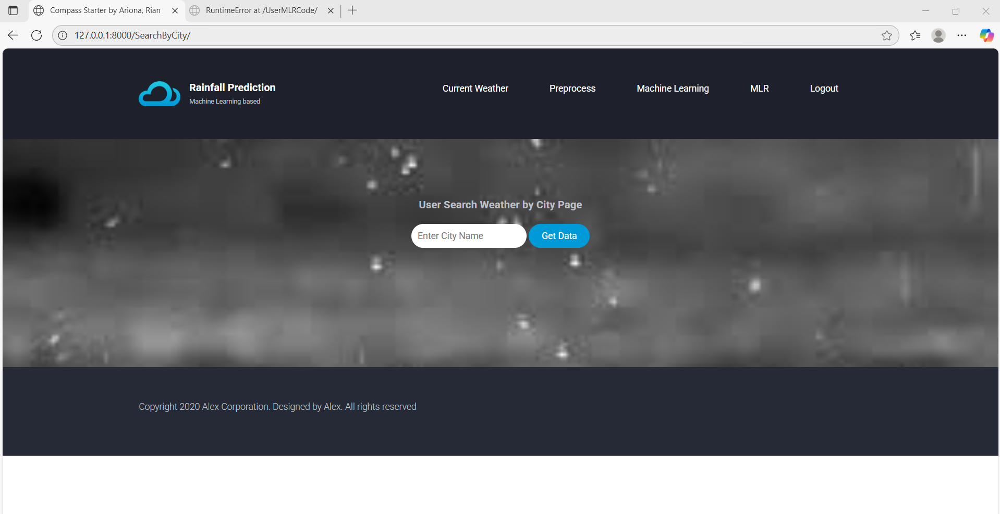
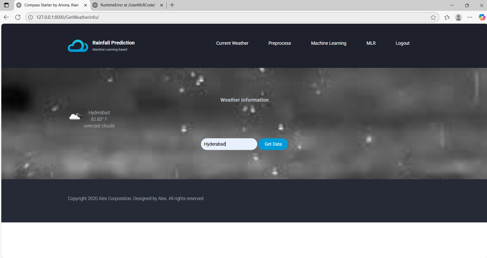

**# 🌧️ Rainfall Prediction using Machine Learning**


**A full-stack Django web application that predicts rainfall patterns using machine learning algorithms and provides real-time weather data by city. Designed for educational, environmental, and meteorological insights.**


**---**


**## 🚀 Features**


**- 📊 Upload and visualize rainfall data**

**- 🧠 Predict rainfall using ML algorithms**

**- 🌍 Fetch real-time weather info by city**

**- 🔒 Admin \& User authentication**

**- 📈 Interactive graphs for analysis**


**---**


**## 🛠️ Tech Stack**


**- \*\*Frontend\*\*: HTML5, CSS3, JavaScript**

**- \*\*Backend\*\*: Python 3.7, Django 3.2**

**- \*\*ML \& Data\*\*: NumPy, Scikit-learn**

**- \*\*Database\*\*: SQLite**

**- \*\*Visualization\*\*: Matplotlib**


**---**

## 📸 Screenshots




---


**## 📦 Setup Instructions**


**### 1. Clone the Repository**

**```bash**

**git clone https://github.com/AjayGanavena/rainfall-prediction-ml.git**

**cd rainfall-prediction-ml**


**2. Create Virtual Environment**

**python -m venv venv**

**venv\\Scripts\\activate  # For Windows**


**3. Install Dependencies**

**pip install -r Requirements.txt**


**4. Run Migrations**

**python manage.py migrate**


**5. Start the Server**

**python manage.py runserver**


**🙋‍♂️ Author**

**Ajay Ganavena**

 [**🔗 GitHub**](https://github.com/AjayGanavena)

 [**💼 LinkedIn**](https://www.linkedin.com/in/ajay-ganavena/)


**📄 License**

**This project is licensed for educational and non-commercial use.**


**⭐️ Show Your Support**

**If you found this project useful or interesting, give it a ⭐️ on GitHub and share it with others!**


